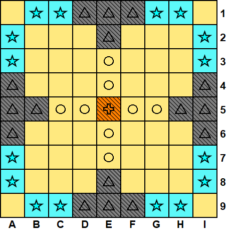

# IA Gioco Tablut

English version [below](#tablut-game-ai).

Progetto di concorso per il corso di Fondamenti di Intelligenza Artificiale presso Università di Bologna.

`tablutai` è una intelligenza artificiale formale basata su conoscenza.
Utilizza principalmente una ricerca negli spazi degli stati ad approfondimento iterativo con tagli Alpha Beta ([Russell-Norvig](http://aima.cs.berkeley.edu/)).



## Preparazione

### Server
Prima di poter iniziare occorre disporre del server relativo seguendo le istruzioni disponibili [qui](https://github.com/AGalassi/TablutCompetition).

### Uso
Aprire un terminale nella cartella root del progetto. Sotto la cartella `bin` è disponibile un fat jar eseguibile pronto all'uso.

Per giocare come bianco:

`java -jar bin/pelle -p w`

Per giocare come nero:

`java -jar bin/pelle -p b`

Per ottenere tutte le opzioni disponibili:

`java -jar bin/pelle -h`

```
pelle 1.x
 Usage: java -jar bin/pelle [options]
 
   -p, --player <value>      Type of player. Use 'w' or 'white' or 'WHITE' for the WHITE player. Use 'b' or 'black' or 'BLACK' for the BLACK player
   -c, --computeTime <value>
                            The max computing time in seconds (only computing NOT the entire player turn). Default is 55
   -s, --serverIp <value>   The server IP. Default is localhost
   -w, --whitePort <value>  The server port for the WHITE player. Default is 5800
   -b, --blackPort <value>  The server port for the BLACK player. Default is 5801
   -d, --debug <value>      Enable debug log texts. Default is false
   -h, --help
```

### Compilazione
Nel caso fosse necessario generare l'eseguibile, aprire un terminale nella cartella root ed eseguire:

`sbt assembly`

il quale compila, esegue tutti i test ed crea un nuovo fat jar sostituendo quello precedente sotto la cartella `bin`.


# Tablut Game AI
Competition project of the Artificial Intelligence Fundamentals course at University of Bologna.

`tablutai` is a formal and knowledge based AI.
It use mainly an iterative deepening alpha beta search ([Russell-Norvig](http://aima.cs.berkeley.edu/)).

## Getting Started

### Server
First, you need the game server available [here](https://github.com/AGalassi/TablutCompetition).

### Usage
Open a new terminal in the root project folder. A ready-to-use fat jar is available under the `bin` folder.

To play as white:

`java -jar bin/pelle -p w`

To play as black:

`java -jar bin/pelle -p b`

To get all the usage details:

`java -jar bin/pelle -h`

```
pelle 1.x
 Usage: java -jar bin/pelle [options]
 
   -p, --player <value>     Type of player. Use 'w' or 'white' or 'WHITE' for the WHITE player. Use 'b' or 'black' or 'BLACK' for the BLACK player
   -c, --computeTime <value>
                            The max computing time in seconds (only computing NOT the entire player turn). Default is 55
   -s, --serverIp <value>   The server IP. Default is localhost
   -w, --whitePort <value>  The server port for the WHITE player. Default is 5800
   -b, --blackPort <value>  The server port for the BLACK player. Default is 5801
   -d, --debug <value>      Enable debug log texts. Default is false
   -h, --help
```

### Compile
If a new executable is required, open a new terminal in the root project folder and execute:

`sbt assembly`

that compiles, executes all the tests and create a new fat jar replacing the old one into the `bin` folder.

# License

MIT License

Copyright (c) 2019 Matteo Pellegrino

Permission is hereby granted, free of charge, to any person obtaining a copy
of this software and associated documentation files (the "Software"), to deal
in the Software without restriction, including without limitation the rights
to use, copy, modify, merge, publish, distribute, sublicense, and/or sell
copies of the Software, and to permit persons to whom the Software is
furnished to do so, subject to the following conditions:

The above copyright notice and this permission notice shall be included in all
copies or substantial portions of the Software.

THE SOFTWARE IS PROVIDED "AS IS", WITHOUT WARRANTY OF ANY KIND, EXPRESS OR
IMPLIED, INCLUDING BUT NOT LIMITED TO THE WARRANTIES OF MERCHANTABILITY,
FITNESS FOR A PARTICULAR PURPOSE AND NONINFRINGEMENT. IN NO EVENT SHALL THE
AUTHORS OR COPYRIGHT HOLDERS BE LIABLE FOR ANY CLAIM, DAMAGES OR OTHER
LIABILITY, WHETHER IN AN ACTION OF CONTRACT, TORT OR OTHERWISE, ARISING FROM,
OUT OF OR IN CONNECTION WITH THE SOFTWARE OR THE USE OR OTHER DEALINGS IN THE
SOFTWARE.